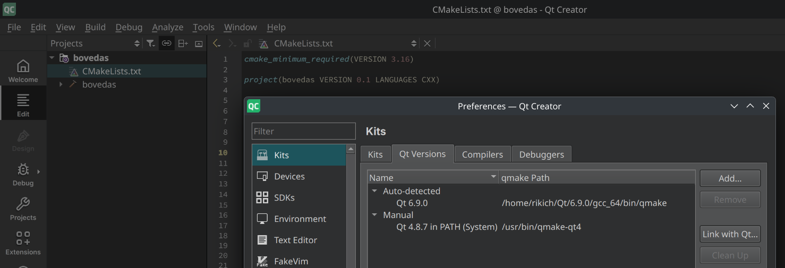

# Sistema de Gestión de Bóvedas Bancarias

Un sistema completo para el seguimiento y gestión de transacciones de activos entre bóvedas bancarias, desarrollado en C++ con Qt Framework.


## 📋 Descripción del Proyecto

Este sistema permite gestionar las transacciones de activos (soles, dólares y joyas) entre bóvedas bancarias, tanto intrabancarias como interbancarias. Incluye:

- **Dashboard en tiempo real** con estado de bancos y bóvedas
- **Panel de control** para gestionar transferencias
- **Sistema de transportadoras** con comisiones configurables
- **Manejo completo de excepciones** del dominio bancario
- **Interfaz gráfica moderna** desarrollada con Qt

## 🏦 Funcionalidades Principales

### ✨ Características del Sistema
- 🏛️ **Gestión de 3 bancos peruanos**: BCP, Scotiabank, BBVA
- 💰 **Manejo de múltiples tipos de activos**: Soles, Dólares, Joyas
- 🚛 **Empresas transportadoras**: Teletrans, Prosegur, Transportes Seguros SA
- 📊 **Dashboard dinámico** con actualización automática cada 5 segundos
- 💼 **Estados de transacción**: Preparación → Recojo → Transporte → Entrega → Completada
- ⚠️ **Sistema robusto de excepciones** según reglas de negocio

### 🎯 Operaciones Disponibles
- ✅ Iniciar transferencias entre bóvedas
- ✅ Procesar transacciones completas
- ✅ Visualizar estado de bancos y activos
- ✅ Configurar transportadora y comisiones (5% - 8%)
- ✅ Validación automática de fondos suficientes

## 🛠️ Requisitos del Sistema

### Dependencias Obligatorias
- **Qt Framework**: 6.0 o superior (recomendado 6.9.0)
- **CMake**: 3.16 o superior
- **Compilador C++**: Compatible con C++17
- **Sistema Operativo**: Linux, Windows, macOS

### Herramientas de Desarrollo (Opcionales)
- **Qt Creator**: Para desarrollo y ejecución simplificada
- **Git**: Para control de versiones

## 🚀 Instalación y Configuración

> 📋 **Para instrucciones detalladas por sistema operativo, ver [SETUP.md](SETUP.md)**

### Opción 1: Usando Qt Creator (Recomendado)

1. **Instalar Qt Creator** desde [qt.io](https://www.qt.io/download)

2. **Verificar instalación de Qt**:
   - Abrir Qt Creator
   - Ir a `Edit` > `Preferences` > `Qt Versions`
   - Verificar que tienes Qt 6.x instalado
   
   
   
   > **📸 Nota**: Coloca una captura de pantalla del diálogo de Qt Versions en la raíz del proyecto con el nombre `qt-versions-screenshot.png` para ayudar a otros desarrolladores a encontrar la ruta correcta.

3. **Abrir el proyecto**:
   ```bash
   # Clonar repositorio
   git clone <repository-url>
   cd bovedas
   
   # Abrir en Qt Creator
   # File > Open File or Project > Seleccionar CMakeLists.txt
   ```

4. **Ejecutar**:
   - Presionar `Ctrl+R` o hacer clic en el botón ▶️ Run

### Opción 2: Compilación Manual con CMake

#### En Linux (Ubuntu/Fedora)

```bash
# Ubuntu: Instalar dependencias
sudo apt update
sudo apt install qt6-base-dev cmake build-essential

# Fedora: Instalar dependencias  
sudo dnf install qt6-qtbase-devel cmake gcc-c++

# Clonar y compilar
git clone <repository-url>
cd bovedas
mkdir build && cd build

# IMPORTANTE: Modificar la ruta a tu instalación de Qt
# Editar CMakeLists.txt línea 12:
# set(CMAKE_PREFIX_PATH "/ruta/a/tu/Qt/6.x.x/gcc_64")

cmake ..
make

# Ejecutar
./bovedas
```

#### En Windows

```cmd
# Instalar Qt desde qt.io
# Instalar CMake desde cmake.org
# Instalar Visual Studio Build Tools

# Clonar repositorio
git clone <repository-url>
cd bovedas
mkdir build
cd build

# IMPORTANTE: Modificar CMakeLists.txt con tu ruta de Qt
# Ejemplo: set(CMAKE_PREFIX_PATH "C:/Qt/6.9.0/msvc2019_64")

cmake .. -G "Visual Studio 16 2019"
cmake --build . --config Release

# Ejecutar
Release\bovedas.exe
```

## ⚙️ Configuración Importante

### 🔧 Modificar Ruta de Qt

**ANTES de compilar**, debes actualizar la ruta de Qt en `CMakeLists.txt`:

```cmake
# Línea 12 en CMakeLists.txt
# Cambiar esta línea por tu ruta específica:
set(CMAKE_PREFIX_PATH "/tu/ruta/hacia/Qt/6.x.x/gcc_64")
```

#### 📍 Encontrar tu ruta de Qt:

**En Qt Creator:**
1. `Edit` → `Preferences` → `Qt Versions`
2. Copiar la ruta que aparece en "qmake location"
3. Remover `/bin/qmake` del final

**Rutas comunes:**
- **Linux**: `/home/usuario/Qt/6.9.0/gcc_64`
- **Windows**: `C:\Qt\6.9.0\msvc2019_64`
- **macOS**: `/Users/usuario/Qt/6.9.0/macos`

## 🎮 Uso del Sistema

### Interfaz Principal

El sistema se divide en dos secciones principales:

#### 📊 Dashboard (Izquierda)
- **Estado de bancos**: Visualización en tiempo real de activos
- **Información de bóvedas**: Detalles por ubicación
- **Resumen de transacciones**: Estados actuales

#### 🎛️ Panel de Control (Derecha)
- **Nueva Transferencia**:
  - Seleccionar banco y bóveda origen/destino
  - Elegir tipo de activo y cantidad
  - Configurar transportadora y comisión
- **Gestión de Transacciones**:
  - Procesar transacciones existentes
  - Ver historial de operaciones

### Ejemplo de Uso

1. **Verificar estado inicial**: El dashboard muestra los 3 bancos con activos aleatorios
2. **Crear transferencia**: 
   - Origen: BCP-001 → Destino: SCOTIA-001
   - Activo: 50,000 Soles
   - Transportadora: Prosegur (6% comisión)
3. **Procesar**: Usar el ID generado para completar la transacción
4. **Verificar**: Los saldos se actualizan automáticamente

## 🐛 Solución de Problemas

### Errores Comunes

#### Error: "Could not find Qt6Config.cmake"
```bash
# Solución: Verificar ruta en CMakeLists.txt
# Asegurar que CMAKE_PREFIX_PATH apunte a tu instalación Qt
```

#### Error: "No se puede agregar una cantidad negativa"
```bash
# Solución: Verificar que los valores sean positivos
# Comisión debe estar entre 0.05 (5%) y 0.08 (8%)
```

#### Error de compilación en Windows
```cmd
# Solución: Usar el compilador correcto
# Para Visual Studio 2019: msvc2019_64
# Para Visual Studio 2022: msvc2022_64
```

### 📋 Verificar Instalación

```bash
# Verificar Qt
qmake --version

# Verificar CMake  
cmake --version

# Verificar compilador
g++ --version  # Linux
cl            # Windows
```

## 🏗️ Arquitectura del Sistema

### Estructura de Clases

```
SistemaBovedas (Controlador Principal)
├── Banco (BCP, Scotia, BBVA)
│   └── Boveda (Múltiples por banco)
│       └── Activo (Soles, Dólares, Joyas)
├── Transaccion (Estados y comisiones)
└── Excepciones (Manejo de errores)
```

### Flujo de Transacciones

```
1. Preparación → 2. Recojo → 3. Transporte → 4. Entrega → 5. Completada
```

## 📝 Consideraciones Adicionales

### Para Desarrollo
- El código sigue estándares C++17
- Documentación inline en headers
- Manejo de memoria con smart pointers
- Arquitectura MVC con Qt

### Para Producción
- Validaciones completas de entrada
- Sistema robusto de excepciones
- Logging automático de transacciones
- Interfaz responsive y moderna

### Datos de Prueba
- **Bancos iniciales**: BCP, Scotiabank, BBVA
- **Activos**: Entre 10M-100M USD equivalentes por banco
- **Bóvedas**: 2-3 por banco con ubicaciones reales
- **Transacciones**: IDs incrementales (TXN-000001, etc.)

## 👥 Contribución

Para contribuir al proyecto:

1. Fork el repositorio
2. Crear rama feature (`git checkout -b feature/nueva-funcionalidad`)
3. Commit cambios (`git commit -m 'Agregar nueva funcionalidad'`)
4. Push a la rama (`git push origin feature/nueva-funcionalidad`)
5. Crear Pull Request

## 📄 Licencia

Este proyecto está bajo la Licencia MIT. Ver `LICENSE` para más detalles.

---

**Desarrollado con ❤️ usando Qt Framework**

Para soporte técnico o consultas, abrir un issue en GitHub.
